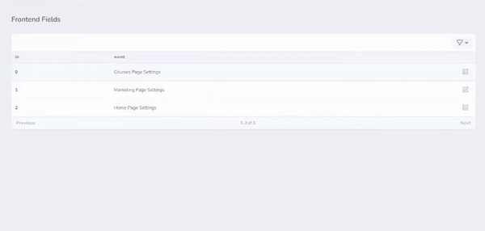

# Laravel nova page settings

[](https://github.com/yaroslawww/nova-page-settings/blob/master/LICENSE.md)
[](https://packagist.org/packages/yaroslawww/nova-page-settings)
[](https://packagist.org/packages/yaroslawww/nova-page-settings)
[](https://scrutinizer-ci.com/g/yaroslawww/nova-page-settings/build-status/master)
[](https://scrutinizer-ci.com/g/yaroslawww/nova-page-settings/?branch=master)
[](https://scrutinizer-ci.com/g/yaroslawww/nova-page-settings/?branch=master)

Ad hoc solution to add settings configuration to laravel nova.

## Installation

You can install the package via composer:

```bash
composer require yaroslawww/nova-page-settings
# optional publish configs
php artisan vendor:publish --provider="ThinkOne\NovaPageSettings\ServiceProvider" --tag="config"
```

## Usage

### Admin part

1. Create settings table

```injectablephp
public function up() {
    Schema::create( 'my_pages_settings', function ( Blueprint $table ) {
        \Thinkone\NovaPageSettings\MigrationHelper::defaultColumns($table);
    } );
}
```

2. Create model

```injectablephp
use Thinkone\NovaPageSettings\PageSetting;

class MyPageSetting extends PageSetting
{
    protected $table = 'my_pages_settings';
}
```

3. Create adapter for settings

```injectablephp
namespace App\Nova\PageSettings\Adapters;

use App\Models\MyPageSetting;
use Thinkone\NovaPageSettings\QueryAdapter\InternalSettingsModel;

class MyPageSettingModel extends InternalSettingsModel
{
    /**
     * @inheritDoc
     */
    public function getDBModel(): string
    {
        return MyPageSetting::class;
    }

    // OPTIONAL, if you need to change default directory folder
    public function getTemplatesPath(): string
    {
        return 'app/Nova/PageSettings/Templates/OtherDirectory';
    }
}
```

4. Create resource

```injectablephp
namespace App\Nova\Resources;

use App\Nova\PageSettings\Adapters\MyPageSettingModel;
use Thinkone\NovaPageSettings\AbstractSettingsResource;

class MyPageSetting extends AbstractSettingsResource
{
    /**
     * The model the resource corresponds to.
     *
     * @var string
     */
    public static $model = MyPageSettingModel::class;
}
```

5. Create templates in folder what you specified in step 3. System will find all templates in folder automatically.

```injectablephp
namespace App\Nova\PageSettings\Templates\OtherDirectory;

use Laravel\Nova\Fields\Image;
use Laravel\Nova\Fields\Text;
use Laravel\Nova\Fields\Textarea;
use Laravel\Nova\Http\Requests\NovaRequest;
use Thinkone\NovaPageSettings\Templates\BaseTemplate;
use NovaFlexibleContent\Flexible;

class MarketingPageSettings extends BaseTemplate
{
    public static function getName(): string
    {
        return 'Marketing Page Settings';
    }

    public function fields(NovaRequest $request)
    {
        return [
            // NOTICE: do not forget use "templateKey" method
            Flexible::make('Slider', $this->templateKey('slider'))
                    ->addLayout('Custom Slide', 'custom_slide', [
                        Text::make('Title', 'title'),
                        Textarea::make('Text', 'text'),
                        Text::make('Button Text', 'btn_text'),
                        Text::make('Button Link', 'btn_link'),
                    ])
                    ->limit(4)
                    ->button('Add Slide'),
            // ... other fields
        ];
    }
}
```

5. As a result, you should see something like this:



### Frontend part

```injectablephp
 /** @var \Illuminate\Support\Collection $pageSettings */
 $pageSettings =  MyPageSettingModel::page(MarketingPageSettings::getSlug())->get();
 // get array of slides using helper
 $slides = page_setting_value( $pageSettings, 'slider', 'array', [] );
```

## Credits

- [](https://think.studio/)
